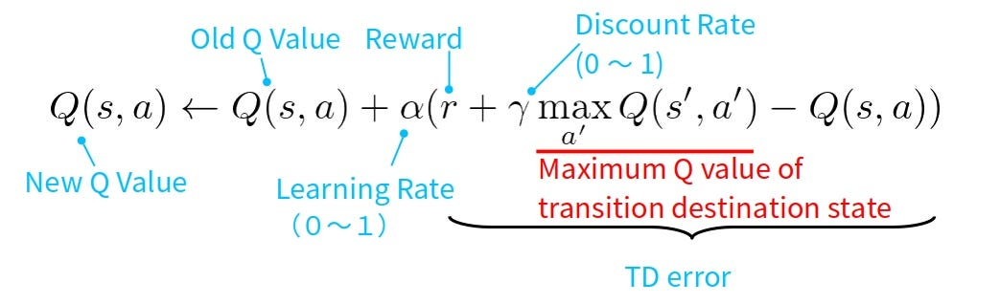

# MontyHallURP
Undergraduate Research Project on the Monty Hall Problem

# Reinforcement Learning Approach to the Monty Hall Problem: A Comparative Study of Adversarial Game Strategies

## Abstract
This project applies Q-learning, a model-free reinforcement learning algorithm, to the Monty Hall problem and its adversarial variants. A modular software system separates game logic, agent behavior, training, and user interface, allowing an agent to learn optimal strategies through trial and error. Across multiple host behaviors—Classic, Evil, Lazy, Angelic, and Ignorant—the agent converges to near-optimal policies, with Q-values reflecting underlying probabilistic structures. Results demonstrate reinforcement learning’s effectiveness in probabilistic decision-making and provide insights into agent behavior in adversarial scenarios.

## Introduction
The Monty Hall problem is a probability puzzle where a contestant chooses one of three doors, one hiding a prize. After the choice, the host opens a door revealing a goat and offers a chance to switch. Switching yields a two-thirds chance of winning, counterintuitively.

Beyond classical analysis, this project uses reinforcement learning to allow an agent to discover strategies through repeated play. We explore adversarial variants with hosts behaving strategically (Evil, Angelic) or deterministically/randomly (Lazy, Ignorant). Using Q-learning with an ϵ-greedy policy, the agent learns to maximize rewards, providing insight into learning under varied probabilistic and adversarial conditions.

## Running the Streamlit Interface

This project includes a Streamlit interface to visualize the agent's learning and gameplay.

### Steps to Run

1. **Navigate to the project directory** in your terminal.

2. **Install dependencies** if they are not already installed:  
pip install -r requirements.txt

3. **Run the Streamlit app**  
streamlit run app.py

4. **Use the Interface**
- Select a host variant (Classic, Evil, Lazy, Angelic, Ignorant)
- Observe the agent’s Q-values, win rates, and decisions
- Optionally adjust training parameters, such as number of episodes or exploration rate

## Q-Learning Methodology
Q-learning is a model-free, value-based reinforcement learning algorithm that estimates the expected cumulative reward of taking an action **a** in a state **s** and following the optimal policy thereafter. Q-values are updated iteratively using the Bellman equation:

Where:  

- **α = 0.1** is the learning rate, controlling how new experiences influence Q-values.  
- **γ = 0.99** is the discount factor, weighting future rewards relative to immediate rewards.  
- **r** is the immediate reward received.  
- **s'** is the next state after taking action **a**.  

For the Monty Hall problem, each episode is independent, so the state space is minimal. The agent only needs to choose between **stay** or **switch**, reducing the Q-table to two values: **Q(stay)** and **Q(switch)**.  

The agent follows an **ϵ-greedy strategy** (**ϵ = 0.1**):  
- With probability ϵ, it selects a random action (**exploration**).  
- With probability 1−ϵ, it chooses the action with the highest Q-value (**exploitation**).  

This strategy ensures sufficient exploration while allowing convergence toward the optimal policy.

## System Architecture and Implementation

The software uses a **modular, layered architecture** to separate concerns and facilitate future extensions.

### Game Environment (`game.py`)
The `MontyHallGame` class handles:
- Prize placement
- Player's initial choice
- Host behavior
- Final decision (stay or switch)

Each episode returns:
- A **binary reward** (`1` for win, `0` for loss)  
- A `GameState` object containing full episode details

### Host Variants

- **Classic Monty:** Knows the prize location, opens a goat door; switching wins 2/3 of the time.  
- **Evil Monty:** Deterministically opens the first goat door; switching advantage largely holds.  
- **Lazy Monty:** Opens the lowest-indexed goat door; predictable but does not change the 2/3 advantage.  
- **Angelic Monty:** Chooses a goat door to guarantee that switching always wins (100%).  
- **Ignorant Monty:** Opens a random door, 50% chance of revealing the prize, making half the games immediately lost.  

### Agent Module
Implements **Q-learning** with an ϵ-greedy policy to learn expected rewards for staying or switching.

### Training Orchestration
- Runs multiple episodes
- Updates Q-values
- Logs statistics

### User Interface (Streamlit)
- Visualizes agent behavior, Q-values, and win rates
- Provides an intuitive platform for research and education

> This design allows easy extension for new host strategies, alternative RL algorithms (e.g., SARSA, DQN), and multi-agent setups where Monty could adaptively learn.

Experimental Results
| Host Variant  | Q(stay) | Q(switch) | Win Rate | Notes |
|---------------|---------|-----------|----------|-------|
| Classic Monty | 0.33    | 0.67      | 65–70%   | Matches theoretical probabilities; switching dominates. |
| Evil Monty    | 0.21    | 0.77      | 60–65%   | Deterministic behavior does not fully negate switching advantage. |
| Lazy Monty    | –       | 0.77      | 60–65%   | Predictable door selection; switching still optimal. |
| Angelic Monty | –       | 0.73      | 60–70%   | Exploration reduces observed win rate; greedy evaluation improves results. |
| Ignorant Monty| 0.17    | 0.28      | ~30%     | Random door selection causes 50% auto-loss games, lowering overall performance. |

## Discussion

### Learning Dynamics
- Q-learning converges quickly within **1,000–2,000 episodes**.  
- Early exploration introduces variance, which stabilizes as episodes increase.

### Architecture Advantages
- Modular design allows flexible experimentation with host strategies, RL algorithms, and multi-agent setups.  
- Streamlit provides **intuitive visualization** of agent behavior and performance.

### Limitations
- State information (door positions) is not fully utilized; including it could refine strategies.  
- Fixed ϵ = 0.1 exploration causes occasional suboptimal choices; decaying ϵ or advanced exploration methods could improve efficiency.

### Insights
- True adversarial hosts require asymmetric information or adaptive behavior.  
- Even Evil Monty cannot fully negate switching under standard Monty Hall rules.

## Conclusion

- Q-learning effectively learns near-optimal strategies across Monty Hall variants.  
- Switching dominates in classic and benevolent scenarios, while hostile environments like Ignorant Monty reduce overall performance.  
- The modular architecture allows independent modification of game logic, agent behavior, training, and visualization.  
- Streamlit provides a clear, intuitive view of learning dynamics, making the framework valuable for both research and education.

**Future Work:**
- State-conditioned Q-learning  
- Adaptive host strategies  
- Multi-agent reinforcement learning  
- Refined exploration policies  

These extensions could further advance understanding of learning in probabilistic and adversarial environments.
